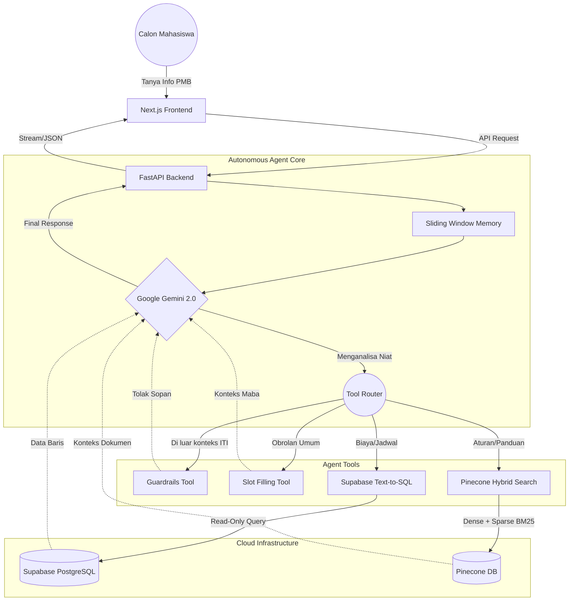

# 🎓 HaloITI: Autonomous Hybrid Agent untuk Penerimaan Mahasiswa Baru (PMB) ITI


🔗 **Live Application:** [https://haloiti.akmalaufa.my.id](https://haloiti.akmalaufa.my.id)

**HaloITI** adalah ekosistem Chatbot cerdas berbasis **Autonomous Agent** yang dirancang secara khusus untuk memberikan pendampingan informasi presisi tinggi bagi calon mahasiswa baru (Maba) Institut Teknologi Indonesia (ITI). 

Sistem ini memecahkan masalah mendasar pada chatbot konvensional (halusinasi informasi dan latensi tinggi) dengan mengimplementasikan arsitektur *Agentic Retrieval-Augmented Generation (RAG)* tingkat lanjut. 

> 💡 **Pure Python Implementation:** Berbeda dengan mayoritas proyek AI, keseluruhan orkestrasi agen (Agentic Orchestration), manajemen memori, dan logika *retrieval* pada proyek ini **dibangun murni dari nol (Pure Python)** menggunakan SDK bawaan Google GenAI, tanpa bergantung pada *framework* abstraksi tingkat tinggi seperti LangChain atau LlamaIndex. Pendekatan ini menghilangkan *overhead* (bloatware), memberikan kontrol absolut terhadap *prompt injection*, dan menghasilkan latensi eksekusi yang sangat rendah.

---

## 🏛️ Arsitektur Sistem (Agentic Flow)



---

## 🧠 Paradigma Sistem: Autonomous 4-Pillars Tooling

Sistem tidak merespons pertanyaan pengguna secara linier. Model LLM (Google Gemini) bertindak sebagai "Otak Otonom" yang secara dinamis menganalisis niat pengguna (*User Intent*) dan memilih untuk mengeksekusi satu atau beberapa dari **4 Alat Utama (Tools)** yang telah didefinisikan menggunakan Skema Pydantic:

### 1. Slot Filling Tool (Conversational State)
Berfungsi untuk menangani percakapan organik yang tidak memerlukan penarikan data dari database. Tool ini menjaga agar percakapan tetap natural saat bot menyapa, mengingat konteks sebelumnya, dan secara perlahan mengumpulkan informasi dari pengguna (Slot Filling) yang nantinya bermuara pada konversi *Lead Generation* (Pendaftaran Calon Mahasiswa).

### 2. Guardrails Tool (Out of Domain Protection)
Sistem pertahanan absolut untuk menjaga integritas *brand* kampus. Alat ini memaksa model untuk memutus rantai penalaran dan secara sopan menolak menjawab jika pengguna mencoba melakukan *jailbreak* atau menanyakan hal-hal yang sama sekali tidak relevan dengan ITI atau proses PMB. Ini memastikan bot tidak pernah berhalusinasi menjawab topik di luar domain pengetahuan.

### 3. Supabase Tool (Native Text-to-SQL)
Sebuah terobosan dalam pengambilan data terstruktur (seperti Biaya Kuliah, Diskon, dan Jadwal Gelombang). 
Alih-alih mencari dari dokumen teks, Gemini secara otonom menerjemahkan bahasa natural manusia menjadi sintaks **Kueri SQL murni (Text-to-SQL)**. Kueri ini kemudian diinjeksikan secara aman ke PostgreSQL (Supabase) dalam mode *Read-Only* menggunakan koneksi *NullPool* untuk menghindari bentrok transaksi. Hasil baris data dari database kemudian diterjemahkan kembali oleh agen menjadi bahasa manusia yang ramah.

### 4. Pinecone Tool (Hybrid Vector Search)
Digunakan ketika agen menghadapi pertanyaan kompleks terkait peraturan, sejarah, atau dokumen panjang yang bersifat *unstructured*. Sistem tidak hanya menggunakan pencarian vektor standar, melainkan **Hybrid Search**:
*   **Dense Retrieval (Semantic):** Menggunakan *Vector Embeddings* untuk mencari berdasarkan "makna" tersembunyi dari pertanyaan.
*   **Sparse Retrieval (Lexical):** Menggunakan `BM25Encoder` untuk melakukan pencocokan kata kunci absolut (*keyword matching*). Uniknya, parameter bobot BM25 (`bm25_params.json`) tidak di-*hardcode*, melainkan diunduh secara dinamis dari Cloud (Supabase Storage) setiap kali *server booting*.

---

## 🚀 Infrastruktur Skala Enterprise & Optimasi Kinerja

Proyek ini dilengkapi dengan berbagai arsitektur spesifik *Software Engineering* tingkat lanjut:

### 🧩 Custom Hierarchical Chunking
Kualitas jawaban sangat bergantung pada bagaimana dokumen dipotong (*chunking*). Sistem tidak memotong berdasarkan jumlah kata, melainkan menggunakan skrip kustom `HierarchicalTextSplitter` yang membedah struktur dokumen berdasarkan hierarki Heading (H1 hingga H4) dan kesinambungan makna semantik, dengan batas toleransi 3000 karakter. Ini memastikan agen LLM menerima konteks yang utuh, bukan paragraf yang terputus di tengah kalimat.

### 💾 Lapis Ganda Global Caching (Double-Layer Cache)
Untuk menekan biaya operasional API (Cost-Saving) secara ekstrem dan memangkas waktu *loading* (*Response Time*), sistem ini merancang Caching 2 Lapis:
1. **Lapis 1 (Semantic Cache via Pinecone):** Menyaring pertanyaan bersinonim. Jika pengguna mengetik pertanyaan dengan makna yang 95% mirip dengan pertanyaan sebelumnya di masa lalu, sistem akan mem-*bypass* proses *thinking* agen dan mengembalikan jawaban yang sudah ada. Dilengkapi fitur *Double-Save*, di mana kueri sintetik dan kueri asli disimpan bersamaan.
2. **Lapis 2 (Tool-Level Cache via Redis):** Jika agen terpaksa memanggil Tool Database, sistem akan melakukan *Hashing* pada argumen JSON yang dieksekusi agen. Jika struktur JSON sama (*Exact Match*), sistem mem-*bypass* akses database dan mengambil data dari *Redis* dengan masa hidup (TTL) 30 Hari. Filter dinamis diterapkan untuk mencopot kunci `sql_query` agar *hash* tetap deterministik.

### 🛡️ Circuit Breaker (Auto-Fallback)
Ketahanan aplikasi dijamin melalui sekering otomatis (`trip_circuit_breaker`) yang dikendalikan oleh Upstash Redis. Jika API Gemini mendadak tumbang, terkena limit transaksi per-menit (RPM), atau terkunci limitasi harian (*429 Too Many Requests*), sistem akan mencatat kegagalan tersebut dan sekering akan "Putus" (*Tripped*). Dalam status ini, *backend* akan melakukan *Bypass/Fallback* secara mandiri, sehingga Maba tidak pernah dihadapkan pada aplikasi yang *Crash* atau pesan *Error 500*.

### 🧠 Manajemen Memori Otonom (Sliding Window Size: 20)
Mencegah terjadinya *Memory Bloat* (pembengkakan token) yang dapat menghabiskan kuota token LLM. Sistem memberlakukan aturan *Sliding Window* ketat berukuran 20 *node* (10 interaksi pengguna-bot terakhir). Riwayat percakapan lama akan otomatis terpotong di latar belakang tanpa merusak inti konteks obrolan yang sedang berjalan.

### ⚙️ Asynchronous Admin Pipeline & Cache Invalidation
Dashboard Admin (Frontend) tidak hanya untuk melihat data. Saat Admin mengunggah dokumen pedoman baru, proses *Chunking*, Vektorisasi massal, hingga *Upsert* ke Pinecone dieksekusi sebagai **Asynchronous Background Task** di FastAPI. Admin tidak perlu menunggu *loading bar* yang lama. 
Lebih jauh, sistem menerapkan **Dynamic Cache Invalidation**: Jika Admin memperbarui harga pendaftaran atau jadwal gelombang, fungsi pemicu (`invalidate_prodi_cache`, dll) akan otomatis menghancurkan *Cache* lama agar Maba selalu mendapatkan informasi *real-time*.

---

## 🛠️ Tech Stack & Ekosistem Spesifik

### 🖥️ Frontend (Client UI & Admin Dashboard)
*   **Next.js 16 (App Router) & React 19:** Fondasi antarmuka performa tinggi.
*   **Tailwind CSS v4 & GSAP:** Penggunaan GreenSock Animation Platform (GSAP) untuk memberikan animasi transisi obrolan dan tata letak yang sangat halus (Fluid UI).
*   **React Virtuoso:** Menangani *Virtualization* pada kotak obrolan, menjaga RAM perangkat pengguna (HP Maba) tetap stabil walaupun riwayat *chat* sudah sangat panjang.
*   **React Markdown & Remark-GFM:** Merender teks tebal, tabel, dan format *markdown* rumit dari balasan LLM secara rapi.
*   **Next-Auth:** Sistem Autentikasi berbasis *Session* untuk mengamankan akses ke rute Admin.

### ⚙️ Backend (AI Core & Security)
*   **FastAPI:** *Framework* asinkronus tercepat di Python untuk menangani konkurensi ratusan permintaan obrolan bersamaan.
*   **Tenacity:** Mengimplementasikan *Retry Logic* dan *Exponential Backoff* untuk mengulang *request* ke AI jika terjadi kegagalan jaringan secara mandiri.
*   **SlowAPI:** Menangani *Rate-Limiting* di level server untuk memblokir IP pengguna yang mencoba melakukan aksi *spam chat* massal.

### 🗄️ Database
*   **Supabase (PostgreSQL):** *Single Source of Truth* untuk data tabular (Prodi, Biaya, Jadwal, Maba Leads) serta menyimpan pengaturan *file* pada Supabase Storage.
*   **Pinecone DB:** Tempat bernaungnya ribuan vektor *embedding* untuk fungsi pencarian semantik tingkat lanjut.
*   **Upstash Redis:** Memori *Key-Value* secepat kilat untuk menampung *Semantic Cache*, *Session Rate Limit*, dan pelacakan *Circuit Breaker*.

---

## 💻 Panduan Instalasi Lokal (Development)

Jika Anda ingin menjalankan proyek ini di mesin lokal, pastikan Anda telah menginstal `Node.js (v18+)`, `Python (v3.10+)`, dan menyiapkan file `.env` di masing-masing direktori.

```bash
# 1. Clone repositori
git clone https://github.com/akmalaufa/HaloITI.git
cd HaloITI

# 2. Jalankan Backend (FastAPI)
cd backend
python -m venv venv
source venv/Scripts/activate # (Untuk Windows)
pip install -r requirements.txt
uvicorn app.main:app --reload --port 8000

# 3. Jalankan Frontend (Next.js)
cd ../frontend
npm install
npm run dev
```
